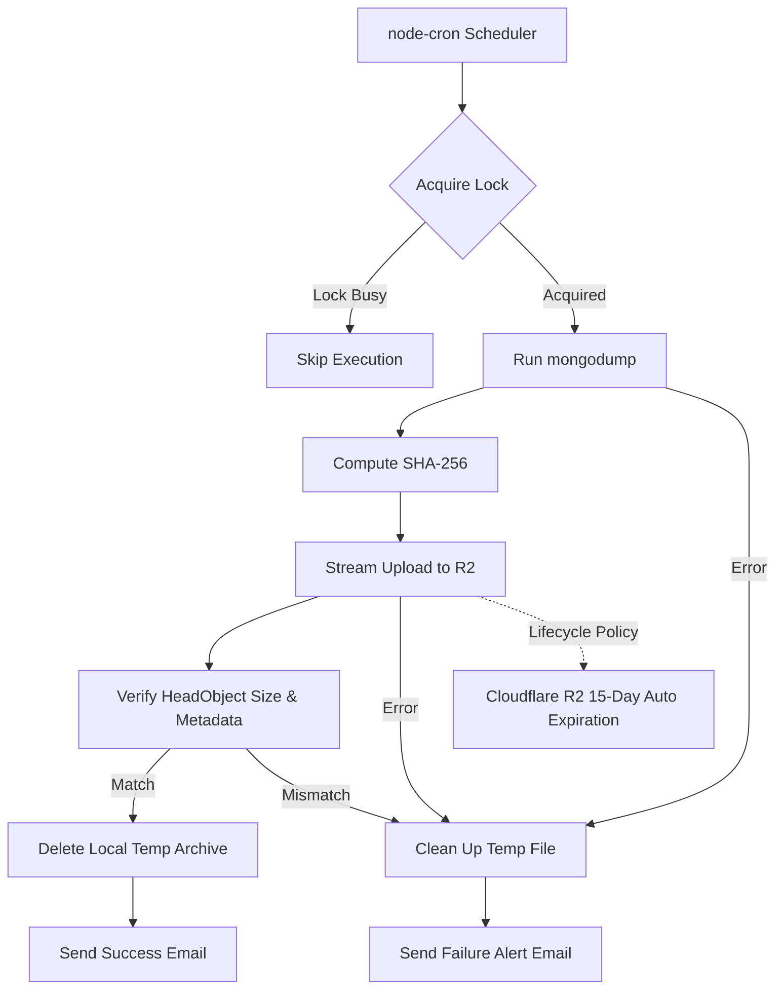

# MediFlux Backup Service

Automated backup daemon for MongoDB. Dumps the database via `mongodump`, compresses into gzip archives, streams to Cloudflare R2 using AWS S3 multipart upload, verifies upload size and metadata, and sends email status alerts.

---

## Architecture Flow



---

## Cloudflare R2 Backup Retention (15-Day Auto Deletion)

Backup retention is handled automatically at the storage level using Cloudflare R2 **Object Lifecycle Rules**. This ensures backups older than 15 days are purged automatically without requiring local deletion scripts.

### Configuring 15-Day Retention in Cloudflare Dashboard

1. Log in to your [Cloudflare Dashboard](https://dash.cloudflare.com/).
2. Select **R2** from the left navigation menu.
3. Click on your backup bucket (e.g., `mongodb-backups`).
4. Select the **Settings** tab.
5. Scroll down to the **Object lifecycle rules** section and click **Add rule**.
6. Configure the rule settings:
   - **Rule name**: `Delete backups after 15 days`
   - **Prefix**: `dynamic/` (or leave blank to apply to the whole bucket)
   - **Lifecycle action**: Select **Delete uploaded objects**
   - **Timeframe**: Set to **15 days**
7. Click **Add rule** to enable the retention policy.

> **Note**: Cloudflare R2 processes lifecycle deletions periodically (typically within 24 hours of object expiration).

---

## Prerequisites

- **Node.js**: v18 or higher
- **MongoDB Database Tools (`mongodump`)**: Installed on system path.

### Installing `mongodump`

#### Ubuntu / Debian
```bash
sudo apt-get install -y gnupg curl

curl -fsSL https://www.mongodb.org/static/pgp/server-7.0.asc | \
   sudo gpg -o /usr/share/keyrings/mongodb-server-7.0.gpg --dearmor

echo "deb [ arch=amd64,arm64 signed-by=/usr/share/keyrings/mongodb-server-7.0.gpg ] https://repo.mongodb.org/apt/ubuntu jammy/mongodb-org/7.0 multiverse" | sudo tee /etc/apt/sources.list.d/mongodb-org-7.0.list

sudo apt-get update
sudo apt-get install -y mongodb-database-tools

# Verify
mongodump --version
```

#### RHEL / CentOS
```bash
sudo tee /etc/yum.repos.d/mongodb-org-7.0.repo <<EOF
[mongodb-org-7.0]
name=MongoDB Repository
baseurl=https://repo.mongodb.org/yum/redhat/\$releasever/mongodb-org/7.0/x86_64/
gpgcheck=1
enabled=1
gpgkey=https://www.mongodb.org/static/pgp/server-7.0.asc
EOF

sudo yum install -y mongodb-database-tools
```

#### macOS
```bash
brew tap mongodb/brew
brew install mongodb-database-tools
```

---

## Environment Setup (`.env`)

Copy `.env.example` to `.env`:

```bash
cp .env.example .env
```

| Variable | Required | Default | Description |
| :--- | :---: | :---: | :--- |
| `MONGODB_URI` | Yes | — | Connection string for source MongoDB |
| `MONGODB_DATABASE` | Yes | — | Target database name |
| `EXCLUDED_COLLECTION` | Yes | — | Collection name to omit from backups |
| `BACKUP_DIR` | No | `/var/backups/mongodb` | Temp folder for `.archive.gz` and `.backup.lock` |
| `BACKUP_TIMEOUT_MINUTES` | No | `180` | Process timeout for `mongodump` execution |
| `R2_ACCOUNT_ID` | Yes | — | Cloudflare Account ID |
| `R2_ACCESS_KEY_ID` | Yes | — | Cloudflare R2 API key ID |
| `R2_SECRET_ACCESS_KEY` | Yes | — | Cloudflare R2 API secret key |
| `R2_BUCKET` | Yes | — | Target bucket name |
| `SMTP_HOST` | Yes | — | Mail server host |
| `SMTP_PORT` | Yes | — | Mail server port |
| `SMTP_SECURE` | No | `true` | Set to `true` for SSL (port 465) or `false` for STARTTLS |
| `SMTP_USER` | Yes | — | SMTP auth username |
| `SMTP_PASSWORD` | Yes | — | SMTP auth password |
| `BACKUP_EMAIL_FROM` | Yes | — | Sender email address |
| `BACKUP_EMAIL_TO` | Yes | — | Recipient email address |

---

## Running in Production with PM2

Install PM2 globally:

```bash
npm install -g pm2
```

Start the daemon process:

```bash
pm2 start src/index.js --name mediflux-backup
```

Check status and logs:

```bash
pm2 status
pm2 logs mediflux-backup
```

Configure automatic startup on system reboot:

```bash
pm2 startup
pm2 save
```

---

## Manual Backup Execution

To trigger a backup immediately outside the cron schedule:

```bash
npm run backup
```

Or execute directly:

```bash
node src/backup.js
```

---

## Codebase Overview

- **`src/index.js`**: Application entry point. Validates env variables, tests SMTP connection, and starts the cron scheduler.
- **`src/backup.js`**: CLI trigger script to run a one-off backup manually.
- **`src/services/backupRunner.js`**: Main workflow coordinator. Handles execution sequence and exception handling.
- **`src/services/lockService.js`**: File locking via `.backup.lock` to prevent overlapping runs.
- **`src/services/mongoDumpService.js`**: Manages `mongodump` child process spawning and timeouts.
- **`src/services/r2Service.js`**: Streams files to Cloudflare R2 via `@aws-sdk/lib-storage` (10MB part size) and verifies upload via `HeadObject` size check and metadata round-trip.
- **`src/services/emailService.js`**: Handles SMTP transport verification and alert dispatching.
- **`src/scheduler/cron.js`**: Sets up `node-cron` schedule configured for `Asia/Kolkata` time zone.

---

## How It Works (Simple Overview)

### 1. Execution Flow
- **Cron Scheduler**: A background timer wakes up at scheduled hours (02:00, 08:00, 11:00, 14:00, 17:00, 20:00, 23:00 IST).
- **Concurrency Lock (`.backup.lock`)**: Before starting, the service acquires a lock file. If a previous backup is still running, it skips execution to avoid overloading server memory/CPU.
- **Database Dump (`mongodump`)**: Spawns `mongodump` to dump and compress the MongoDB database into a temporary `.archive.gz` file on disk.

### 2. Upload Verification
- **Size Check**: After upload, the service queries R2 (`HeadObject`) and verifies the remote object's byte size matches the local file size exactly. This catches truncated or incomplete uploads.
- **SHA-256 Metadata Tag**: The local file's SHA-256 hash is calculated before upload and attached as custom metadata. After upload, the service reads this metadata back to confirm R2 stored it correctly. This is a **metadata round-trip check**, not a content integrity check — R2 does not re-compute the hash server-side.

> **Limitation**: Cloudflare R2 does not support AWS S3's `ChecksumAlgorithm` feature, so true server-side content verification is not available. For full end-to-end integrity, you would need to download the object after upload and re-hash it. The SHA-256 metadata is still useful during restore as a verification reference.

HENCE BEFORE RESTORE WE CAN STILL DOWNLOAD THE DUMP AND VERIFY THE INTEGRITY OF THE ARCHIVE BY HASHING THE FILE AND COMPARING IT WITH METADATA SAVED HASH

### 3. Multipart Upload & Cleanup
- **Multipart Stream Upload**: The archive is uploaded in small 10MB parts (2 streams at a time). If a network stutter occurs, only that specific 10MB chunk is retried rather than restarting the entire upload.
- **Local File Deletion**: After successful remote verification, the local file is unlinked to save disk space. If an error occurs during any step, the local file is also cleaned up automatically to prevent disk fill from accumulated failed backups.
- **Auto Retention**: Cloudflare R2 automatically purges backups older than 15 days based on your bucket lifecycle policy.
- **Email Alerts**: Sends a detailed SMTP email report containing duration, size, SHA-256 hash, or failure error traces. SMTP connectivity is verified on service startup — if SMTP is unreachable, the service will not start.

---

## License
ISC
